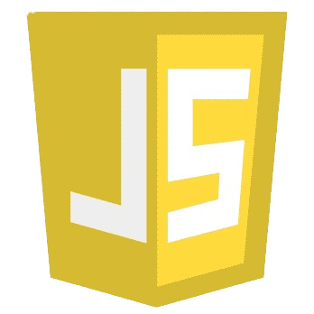

<h1>Hi there, I am <a href="https://rohandas28.github.io" target="_blank">Hadi</a> 🙋🏽‍♂️</h1> 

A passionate **Front-End & Python Developer**, creating modern, responsive websites and exploring Python for AI, automation, and data projects.

---

## My Skills 

**Languages**  

||||||
|--|--|--|--|--|--|--|  

**Tools**  
||||||  
|--|--|--|--|--|--|--|  

**Libraries**  
||||  
|--|--|--|--|--|  

---

## 📂 Projects I’ve Worked On  

### 🔹 [Jarvis AI Assistant](https://github.com/hadihassan5/Jarvis-AI-Assistant)  
A personal virtual assistant built in Python that can open apps, search the web, and perform daily tasks with voice commands.  

### 🔹 [AI Auto Reply Bot](https://github.com/hadihassan5/AI-AutoReply-Bot)  
An intelligent auto-chat bot written in Python that replies to messages in real time using automation and AI.  

### 🔹 [Spotify Clone](https://github.com/hadihassan5/Spotify_Clone)  
A front-end project inspired by Spotify with a clean UI and responsive design for music lovers.  

### 🔹 [Portfolio Website](https://github.com/hadihassan5/Hadi-Portfolio)  
My personal portfolio to showcase skills, projects, and experience.  

---

**Connect with Me**
---

 

---

✨ Always curious, always building whether it’s a sleek website or a smart Python script.  
